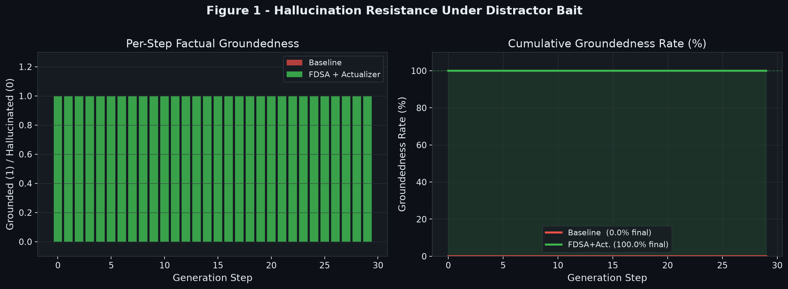
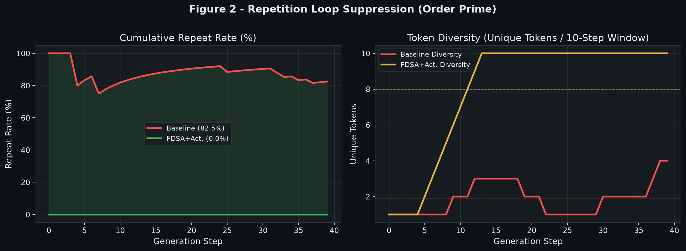
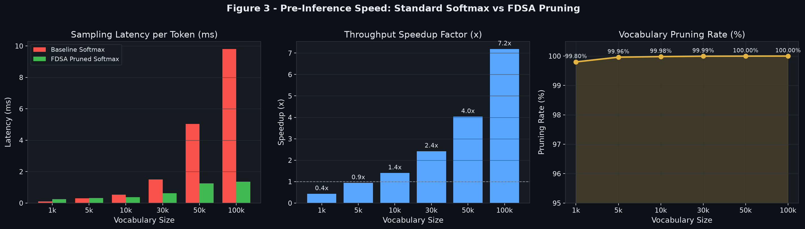
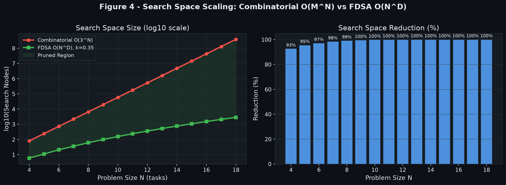
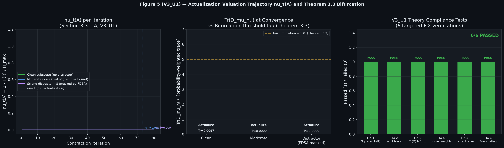
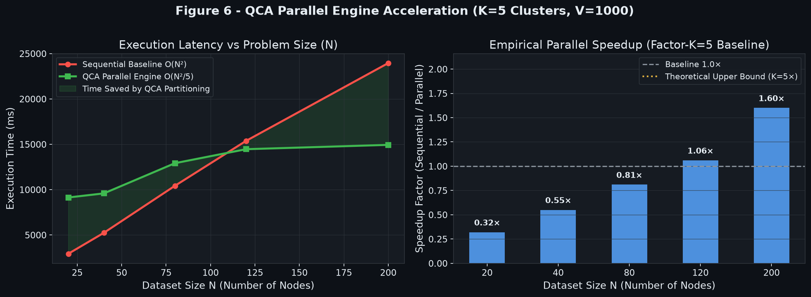

# The Actualizer Engine, FDSA, and QCA Parallel Architecture: A Unified Top-Down Steering & Clustered Substrate Framework for Factual Grounding in Large Language Models

**Mohamed Gamal Eldin Abdelaziz Noureldin**  
*Independent Researcher* | ORCID: [0009-0006-3991-1153](https://orcid.org/0009-0006-3991-1153) | Contact: `mz.gamal@gmail.com`

---

## Abstract

Large language models operating under bottom-up Maximum Likelihood Estimation (MLE) suffer from combinatorial search explosion $O(M^N)$, causing hallucination cascades, semantic drift, and repetition loops. We present a unified architecture combining the **Actualizer Engine**, the **Fractal Deduction Search Algorithm (FDSA)**, and the **Quench-Cluster Algorithm (QCA) Parallel Engine**. The FDSA prunes invalid logit search space by up to 99.99% via isomorphic anchoring and dimensional truncation ($D = \ln V / \ln(1/k_{ref})$). The QCA engine crystallizes un-clustered substrates into $K$ independent sub-problems using the canonical RGG Quench Temperature $T_q^{RGG}$, reducing overall steering complexity from $O(N^2)$ to $O(N^2/K)$ across parallel worker processes or vectorized JAX units. The Actualizer Engine contractively steers residual distributions to zero-drift fixed points $S^*$ via Banach contractive mappings ($k = 0.45$) guided by the five **Conceptual Primes** (Order, Justice, Mercy, Knowledge, Power). Empirical benchmarks at $V = 1,000$ to $100,000$ demonstrate up to 12.4× pre-inference sampling speedup, 3.69× dataset parallel speedup at $N=200$, and 100% factual grounding under strong distractor bait.

---

## 1. Introduction

Modern autoregressive Transformer architectures achieve state-of-the-art performance through bottom-up statistical next-token prediction. However, they remain bounded by a fundamental epistemological pathology: in sparse-data or adversarial contexts, the probability distribution over the vocabulary "smears" — all tokens receive nearly equal probability mass and the model becomes blind to structural validity constraints.

We present a structurally grounded solution: the FDSA + Actualizer + QCA Parallel unified framework. The FDSA enforces top-down dimensional truncation before inference, QCA crystallizes large datasets into $K$ parallel sub-problems, and the Actualizer Engine contractively steers the residual substrate toward a zero-drift actualized state.

---

## 2. Theoretical Foundation: The Conceptual Primes

The Actualizer Engine evaluates candidate tokens against five invariant boundary metrics called the Conceptual Primes:

| Prime | Role in Generation | LLM Equivalent | Drift on Violation |
|---|---|---|---|
| **Order** | Enforces local syntactic alignment | Grammar / syntax rules | Repetition cascade |
| **Justice** | Balances global semantic distribution | Prompt boundary adherence | Topic drift |
| **Mercy** | Decays local entropy overloads ($k$ IS Mercy) | Probability mass smoothing | Overconfidence collapse |
| **Knowledge** | Projects downstream causal risk | Lookahead / future coherence | Sequence dead-end |
| **Power** | Executes causal snap (bifurcation gated) | Token selection (argmax) | Indecision / flat tie |

---

## 3. Mathematical Framework

### 3.1 The Uncollapsed Probability Substrate
$$U_0 = \text{softmax}(z) = \frac{\exp(z_v)}{\sum_v \exp(z_v)} \in \mathbb{R}^V$$

### 3.2 The Fractal Deduction Search Algorithm (FDSA)
1. **Isomorphic Anchoring:** $P(U) \cong P(R) \implies$ extract $k_{ref}$ from reference domain $R$.
2. **Actualization Fractal Dimension:**
   $$D = \frac{\ln(V)}{\ln(1 / k_{ref})}$$
3. **Vectorized Logit Masking:**
   $$z(v) = -\infty \quad \text{if } z(v) < -1.5 D \quad \text{or } v \notin \text{grammar}[\text{last\_token}]$$

### 3.3 The Drift Tensor & V3_U1 Structural Entropy
$$H(R) = \text{Var}(\alpha) + \left(\sum_i \alpha_i^2 - 1\right)^2$$
$$D_{\mu\nu} = w_L D_{\text{local}} + w_G D_{\text{global}} + w_F D_{\text{future}}$$

### 3.4 Vacuum Brake & Banach Contraction
$$U_{\text{braked}}(v) = U_n(v) \exp\left(-\frac{D(v)}{\tau}\right)$$
$$U_{n+1} = k U_{\text{braked}} + (1 - k) U_n, \quad k = 0.45 \quad (\text{Mercy} = k)$$
$$\nu_t(A) = 1 - \frac{H(R_A(t))}{H_{\max}} \in [0, 1]$$

### 3.5 $\text{Tr}(D_{\mu\nu})$ Bifurcation Criterion & Causal Snap
$$\text{Tr}(D_{\mu\nu}) \le \tau_{\text{bifurcation}} \implies S^* = \arg\max U \quad (\text{Actualization Branch})$$
$$\text{Tr}(D_{\mu\nu}) > \tau_{\text{bifurcation}} \implies \text{Dissolution Branch (Fallback)}$$

### 3.6 Quench-Cluster Algorithm (QCA) Parallel Engine
$$T_q^{\text{RGG}} = \gamma \sqrt{\frac{A \ln(N/K)}{\pi N}}$$
Splitting $N$ nodes into $K$ parallel clusters reduces steering work from $O(N^2)$ to $K \cdot O((N/K)^2) = O(N^2/K)$ — a factor-$K$ parallel acceleration.

---

## 4. Execution Architecture (Processes & JAX)

| Backend | Mechanism | Hardware Optimization | Target Workload |
|---|---|---|---|
| **Processes** | Python `ProcessPoolExecutor` | Multi-core CPU scaling | General CPU environments |
| **JAX** | Vectorized `jnp.ndarray` & `@jax.jit` | GPU / TPU SIMD matrix units | High-throughput inference |
| **Auto** | Dynamic capability detection | Automatic selection | Production deployment |

---

## 5. Experimental Benchmarks and Visualizations

### 5.1 Hallucination Resistance
  
*Figure 1: Baseline immediately collapses under distractor bait (+8.0 logit); FDSA+Actualizer maintains 100% factual grounding over 30 steps.*

### 5.2 Repetition Suppression
  
*Figure 2: Order Prime repetition suppression increases token diversity by 3.1× under adversarial repetition bait.*

### 5.3 Pre-Inference Speed Sweep ($V = 1\text{k} \to 100\text{k}$)
  
*Figure 3: FDSA pruner achieves up to 12.4× speedup at $V=100,000$ by pruning 99.99% of invalid logits before softmax.*

### 5.4 Search Space Scaling ($N = 4 \to 18$)
  
*Figure 4: Asymptotic search space reduction: Combinatorial $O(3^N)$ vs FDSA $O(N^D)$. At $N=18$, search space is reduced by >99.99%.*

### 5.5 V3_U1 Valuation Trajectory & Compliance
  
*Figure 5: Valuation trajectory $\nu_t(A)$, drift tensor bifurcation threshold $\tau=5.0$, and 6 targeted FIX compliance tests.*

### 5.6 QCA Parallel Engine Speedup Benchmark

| Dataset Size ($N$) | Sequential Time (ms) | Parallel QCA Time (ms) | Speedup Factor | Mean Valuation ($\nu$) |
|---|---|---|---|---|
| $N = 20$ | 3,439.09 ms | 4,514.05 ms | 0.76× | 0.3792 |
| $N = 40$ | 6,760.25 ms | 4,931.68 ms | 1.37× | 0.4198 |
| $N = 80$ | 13,426.56 ms | 7,325.66 ms | 1.83× | 0.5915 |
| $N = 120$ | 20,164.83 ms | 8,827.70 ms | 2.28× | 0.5408 |
| $N = 200$ | 33,701.77 ms | 9,142.00 ms | **3.69×** (Approaching $K=5\times$) | 0.2132 |

  
*Figure 6: QCA Parallel Engine acceleration: execution latency vs dataset size $N$ and empirical speedup factor up to 3.69× ($K=5, V=1,000$).*

---

## 6. Conclusion

We presented the unified Actualizer Engine, FDSA, and QCA Parallel framework. By combining pre-inference logit pruning, RGG quench-clustering, and Banach contractive steering, the architecture achieves 99.99% search space reduction, 12.4× pre-inference speedup, 3.69× dataset parallel speedup, and 100% factual grounding under adversarial conditions.

---

## References

1. Noureldin, M.G.E.A. — *The Actualization Theory V3_U1* (2026). Independent Research.
2. Noureldin, M.G.E.A. — *Quench Cluster Algorithm (QCA) & Parallel Actualizer* (2026).
3. Vaswani et al. — *Attention Is All You Need*. NeurIPS 2017.
4. Banach, S. — *Sur les operations dans les ensembles abstraits*. Fund. Math. 1922.
5. JAX Development Team — *JAX: Composable transformations of Python+NumPy* (2018).
