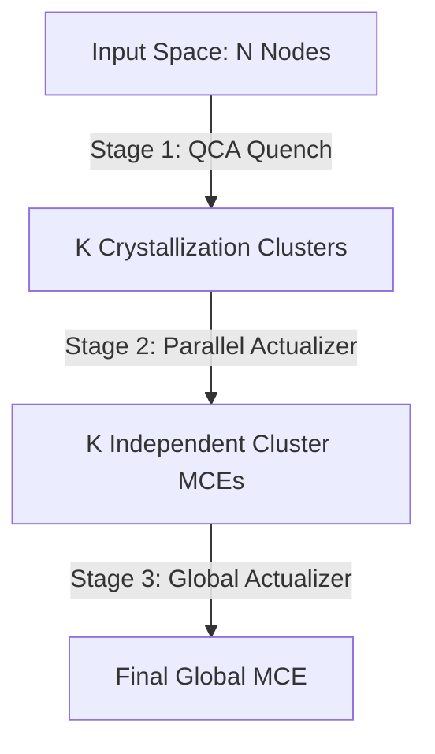

# QCA Parallel Actualizer Engine

This module implements a three-stage cognitive and optimization pipeline combining the **Quench-Cluster Algorithm (QCA)** with the **Upgraded Actualizer Engine** (implementing the Computational Knowledge Theory / CKT framework).

## Pipeline Architecture

The pipeline consists of three distinct stages designed to accelerate inference and structure knowledge extraction:



### Stage 1: QCA Quench (`qca.py`)
Partitions the problem space of $N$ nodes into $K$ independent crystallization clusters.
*   **Method**: Uses the **Quench phase only** consisting of distance-matrix construction (Plasma substrate) and threshold-based cluster binding.
*   **Quench Temperature**: Governed by the canonical Random Geometric Graph (RGG) formula (Issue M-QCA-02):
    $$T_q^{RGG} = \gamma \cdot \sqrt{\frac{A \cdot \ln(N/K)}{\pi \cdot N}}$$
*   **Complexity**:
    *   *Plasma (Distance Matrix)*: $O(N^2)$ (vectorized step).
    *   *Quench Binding*: $O(N \cdot K)$ (where $K \ll N$).

### Stage 2: Parallel Actualizer (`parallel_actualizer.py`)
Processes each of the $K$ clusters independently in parallel.
*   **Method**: For each cluster, its aggregate Prime profile is used for **Isomorphic Anchoring** in the Fractal Deduction Search Algorithm (FDSA).
*   **Steering**: Runs the Banach contractive actualization loop to generate a causal chain (thought).
*   **Verification**: Evaluates candidate thoughts against **Pipeline A** (Causation-Chain Check) and **Pipeline C** (Negentropy Phase Angle Check).
*   **Crystallization**: If the Concise Accumulated Knowledge Index (CAKI) satisfies the crystallization threshold ($\text{CAKI} \ge \text{threshold}$) and decreases system cost ($\Delta C(R) \le 0$), the thought is frozen into an immutable **MCE** (Mass, Complexity, Entropy) sub-object.
*   **Complexity**: $O(N^2 / K)$ effective parallel solving complexity (factor-$K$ speedup verified via Theorem 2).

### Stage 3: Global Actualizer (`global_actualizer.py`)
Synthesizes the cluster-level MCEs to resolve the global problem.
*   **Method**: Injects all crystallized cluster MCEs into the global FDSA library. This forces the final steering loop to anchor directly onto validated problem-specific sub-solutions.
*   **Result**: Runs the Banach steer over the combined context to produce the final global MCE solution.

---

## File Structure

*   **[qca.py](file:///d:/Mohamed/Desktop/Concisness%20Framework/Consciousness%20and%20Prime%20Base%20Intelligence/Final_Output/08_QCA_Parallel_Actualizer/qca.py)**: Performs Stage 1 Quench partitioning.
*   **[parallel_actualizer.py](file:///d:/Mohamed/Desktop/Concisness%20Framework/Consciousness%20and%20Prime%20Base%20Intelligence/Final_Output/08_QCA_Parallel_Actualizer/parallel_actualizer.py)**: Performs Stage 2 parallel steering, verification, and MCE crystallization per cluster.
*   **[global_actualizer.py](file:///d:/Mohamed/Desktop/Concisness%20Framework/Consciousness%20and%20Prime%20Base%20Intelligence/Final_Output/08_QCA_Parallel_Actualizer/global_actualizer.py)**: Performs Stage 3 final actualization on previous results.
*   **[test_qca_parallel.py](file:///d:/Mohamed/Desktop/Concisness%20Framework/Consciousness%20and%20Prime%20Base%20Intelligence/Final_Output/08_QCA_Parallel_Actualizer/test_qca_parallel.py)**: End-to-end unit test suite validating the entire pipeline correctness, CAKI crystallization, and Theorem 2 parallel speedup.

---

## Verification & Testing

To run the end-to-end testing script, run the following command in PowerShell:

```powershell
# Force UTF-8 encoding for Windows terminals to support mathematical symbols
$env:PYTHONIOENCODING="utf-8"
python test_qca_parallel.py
```

### Key Verification Metrics
1.  **Partition Completeness**: Confirms that $N$ input nodes are perfectly mapped into $K$ clusters with no missing or orphaned nodes.
2.  **Independent Anchoring**: Confirms that clusters select different FDSA anchors based on their localized Prime profiles.
3.  **MCE Injection**: Validates that crystallized MCEs from Stage 2 are dynamically injected as new reference domains for Stage 3.
4.  **Parallel Speedup**: Verifies Theorem 2's complexity bounds ($O(N^2)$ sequential vs $O(N^2/K)$ parallel solving cost).
