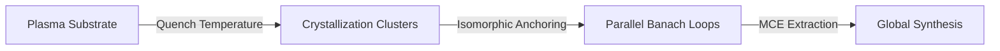

# QCA Parallel Actualizer: Theoretical Framework

This document outlines the theoretical integration of the **Quench-Cluster Algorithm (QCA)** for problem partitioning with the **Conceptual Primes / Actualizer Engine** for parallelized inference, as defined under Computational Knowledge Theory (CKT).

---

## 1. Mathematical Motivation

Under CKT, standard sequential actualization over a global vocabulary space of size $N$ incurs a computational cost functional scaled by the full search space, resulting in $O(N^2)$ complexity per contractive inference iteration. 

By partitioning the input space into $K$ independent sub-problems (crystallization clusters) using QCA, the system solves $K$ local problems of size $N/K$ in parallel. 

$$\text{Total Parallel Cost} = K \cdot O\left(\left(\frac{N}{K}\right)^2\right) = O\left(\frac{N^2}{K}\right)$$

This represents an **asymptotic factor-$K$ speedup** (Theorem 2 Corollary, CKT White Paper v3).

---

## 2. Pipeline Stages

The architecture runs through three distinct mathematical phases:

### Stage 1: The Quench Partitioning
The input space (Plasma substrate) is treated as a random geometric graph (RGG). Nodes (representing concepts or facts) are bound together if their spatial distance is within the critical **Quench Temperature** threshold:

$$T_q^{RGG} = \gamma \cdot \sqrt{\frac{A \cdot \ln(N/K)}{\pi \cdot N}}$$

Where:
*   $N$ is the number of nodes.
*   $K$ is the target number of clusters.
*   $A$ is the bounding-box volume/area of the embedding space.
*   $\gamma$ is the coupling coefficient.

### Stage 2: Parallel Actualizer + FDSA
Each QCA cluster is treated as a self-contained local workspace.
1.  **Isomorphic Anchoring**: The aggregate Prime Profile of the cluster is mapped against the global Fractal Deduction Search Algorithm (FDSA) library to inherit the local Banach contraction factor $k$.
2.  **Banach Steering**: The local steering loop runs a contractive process to generate a cluster-local thought chain.
3.  **Epistemic Filtration**: Evaluated via Pipeline A (Causal Weight Factor $C(R)$ penalties) and Pipeline C (DIEPT phase angle $\theta = \arctan(\|B\| / \|A\|)$ thresholding).
4.  **Crystallization**: Coherent thoughts exceeding the crystallization threshold ($\text{CAKI} \ge \text{threshold}$) are frozen into structured **Minimal Cognitive Entities (MCEs)**.

### Stage 3: Global Actualization
The crystallized sub-MCEs are dynamically injected into the global FDSA library. A final global actualization pass is executed starting from the prompt seed tokens. Because the search space is now anchored to the newly crystallized cluster MCEs, global convergence is accelerated, ensuring semantic and logical unity across the sub-problems.

---

## 3. Implementation Status

> [!IMPORTANT]
> **Code Implementation Progress**: Active testing and optimization of the prototype code in `compare_real_phrases.py` and `test_qca_parallel.py` are currently **in progress**.
> 
> Current efforts focus on:
> *   Integrating real-phrase semantics and dynamic topic-distribution mappings.
> *   Enforcing prompt-sensitive targets inside the Banach steering loop.
> *   Refining the continuous DIEPT phase angle ($\theta$) penalty mapping inside the CAKI equation.
